# 🔬 TSE Automation WEB — Laboratuvar Yönetim ve Otomasyon Platformu

<p align="center">
  <a href="#">
    
  </a>
  <a href="#">
    
  </a>
  <a href="#">
    
  </a>
  <a href="#">
    
  </a>
  <a href="#">
    
  </a>
</p>

> **TSE Automation WEB**, Türk Standardları Enstitüsü (TSE) laboratuvar süreçlerini dijitalleştirmek, operasyonel verimliliği artırmak ve raporlama işlemlerini otomatize etmek amacıyla geliştirilmiş kapsamlı bir yönetim sistemidir.

## 📋 Proje Hakkında

Bu proje, laboratuvar ortamındaki karmaşık iş akışlarını tek bir merkezi platformda toplar. **Makine yönetimi**, **deney takibi**, **kalibrasyon/bakım periyotları** ve **personel performansı** gibi kritik süreçleri yönetirken, yöneticilere detaylı veri analitiği ve otomatik raporlama imkanları sunar.

- **Frontend**: React 19 + TypeScript + Vite
- **Backend**: Node.js + Express v5
- **Veritabanı**: PostgreSQL (Prod) / SQLite (Dev)
- **Otomasyon**: Node-Cron + Nodemailer ile haftalık otomatik raporlar
- **Özellikler**: 
  - Dinamik deney ve başvuru yönetimi
  - Makine kalibrasyon ve bakım takibi
  - Gelişmiş grafiksel analiz panelleri (Dashboard)
  - Excel formatında otomatik rapor çıktıları

---

## 📂 Proje Mimarisi ve Klasör Yapısı

Proje, modern yazılım geliştirme prensiplerine uygun olarak **Monorepo** benzeri bir yapıda kurgulanmış olup, Frontend, Backend ve Otomasyon servislerini ayrı katmanlarda barındırır.

```
TSE_Automation_WEB/
├── automated-reports/              # 📧 OTOMATİK RAPORLAMA SERVİSİ (Bağımsız Node.js Uygulaması)
│   ├── src/
│   │   ├── mailer.ts               # SMTP ayarları ve e-posta şablon yönetimi (Nodemailer)
│   │   ├── report.ts               # Veritabanından haftalık veriyi çekip Excel'e işleyen lojik
│   │   ├── server.ts               # Cron Job zamanlayıcısı (Her Pazartesi 09:00)
│   │   └── cleanup.ts              # Oluşturulan geçici rapor dosyalarının temizlenmesi
│   └── package.json                # Servis bağımlılıkları
│
├── public/                         # 🌐 STATİK VARLIKLAR
│   └── ...                         # Web sunucusu tarafından doğrudan sunulan dosyalar
│
├── readMeImage/                    # 🖼️ DOKÜMANTASYON GÖRSELLERİ
│   └── ...                         # README dosyasında kullanılan ekran görüntüleri
│
├── server/                         # 🔙 BACKEND API (Node.js + Express + TypeScript)
│   ├── src/
│   │   ├── db/                     # Veritabanı bağlantı katmanı (Prod: PostgreSQL, Dev: SQLite)
│   │   ├── repos/                  # 🗄️ REPOSITORY KATMANI (Veritabanı Erişim Nesneleri)
│   │   │   ├── machine.repo.ts     # Makine verileri için SQL sorguları
│   │   │   ├── application.repo.ts # Deney başvuruları ve durum güncellemeleri
│   │   │   ├── user.repo.ts        # Kullanıcı yetkilendirme sorguları
│   │   │   └── ...                 # Diğer varlık repository'leri
│   │   ├── routes/                 # 🚦 ROUTE KATMANI (REST API Uç Noktaları)
│   │   │   ├── machine.route.ts    # GET/POST/PUT/DELETE makine işlemleri
│   │   │   ├── auth.route.ts       # Login ve Token yenileme işlemleri
│   │   │   └── ...                 # Diğer API rotaları
│   │   ├── services/               # 🧠 SERVİS KATMANI (İş Mantığı)
│   │   │   ├── alert.service.ts    # Kalibrasyon/Bakım tarihi hesaplama algoritmaları
│   │   │   └── ...                 # Validasyon ve iş kuralları
│   │   ├── app.ts                  # Express sunucu konfigürasyonu ve Middleware'ler
│   │   └── schema.sql              # Veritabanı tabloları ve ilişkileri (DDL)
│
├── src/                            # 🖥️ FRONTEND (React 19 + TypeScript + Vite)
│   ├── components/                 # 🧩 YENİDEN KULLANILABİLİR BİLEŞENLER
│   │   ├── Sidebar.tsx             # Dinamik sol menü (Admin/User yetkisine göre değişir)
│   │   ├── ProtectedRoute.tsx      # Oturum kontrolü yapan güvenlik katmanı
│   │   ├── AdminRoute.tsx          # Yetki kontrolü yapan güvenlik katmanı
│   │   ├── KalibrasyonModal.tsx    # Makine listesinde açılan hızlı işlem penceresi
│   │   └── BakimModal.tsx          # Bakım kayıt penceresi
│   ├── pages/                      # 📄 UYGULAMA SAYFALARI (Detayları aşağıdadır)
│   ├── services/                   # 📡 HTTP İSTEK KATMANI (Axios)
│   │   └── api.ts                  # Backend ile iletişim kuran merkezi servis
│   ├── App.tsx                     # Ana uygulama ve Route tanımları
│   └── main.tsx                    # React DOM render noktası
│
└── docker-compose.yml              # 🐳 Konteyner orkestrasyonu (Postgres & PGAdmin)
```

---

## 🚀 Modüller ve Sayfa Detayları

Bu bölümde uygulamanın her bir sayfasının ne işe yaradığı, hangi özellikleri barındırdığı ve kullanıcıya ne sunduğu en ince detayına kadar açıklanmıştır.

### 1. Giriş ve Güvenlik Modülü (`src/pages/Login`)
Uygulamaya erişim, güvenli bir kimlik doğrulama katmanı ile korunur.
- **Güvenlik:** Kullanıcı şifreleri veritabanında `bcrypt` ile hashlenmiş olarak saklanır. İletişim `JWT` (JSON Web Token) üzerinden sağlanır.
- **Rol Yönetimi:**
  - **Admin:** Tüm sayfalara erişebilir, silme ve düzenleme yetkisine sahiptir.
  - **User:** Sadece veri girişi yapabilir ve raporları görüntüleyebilir. Kritik ayarları değiştiremez.
- **Bilgilendirme:** Giriş ekranında yer alan "Hakkımızda" butonu, sistemin amacı hakkında özet bilgi veren bir modal açar.

<p align="center">
  
  
  <br/>
  <em>Giriş Ekranı ve Hakkımızda Bilgilendirme Paneli</em>
</p>

---

### 2. Analiz ve Dashboard (`src/pages/Analiz`)
Yöneticilerin laboratuvar performansını tek bakışta görebilmesi için tasarlanmış ana kontrol panelidir. **Recharts** kütüphanesi ile dinamik grafikler sunar.

- **KPI Kartları:**
  - **Toplam Deney:** Sistemdeki toplam kayıtlı deney sayısı.
  - **Aktif Makine:** Envanterdeki çalışır durumdaki cihaz sayısı.
  - **Bekleyen İşler:** Henüz tamamlanmamış deney başvuruları.
- **Grafikler:**
  - **Zaman Trendi (Line Chart):** Aylık bazda deney sayılarının artış/azalış trendini gösterir. Mevsimsel yoğunlukları analiz etmek için kullanılır.
  - **Firma Dağılımı (Pie Chart):** Laboratuvarın en çok hangi firmalara hizmet verdiğini oransal olarak gösterir.
  - **Personel Performansı (Bar Chart):** Hangi personelin kaç adet deney gerçekleştirdiğini kıyaslar. İş yükü dağılımını dengelemek için kritiktir.
  - **Test Türü Analizi (Radar/Bar Chart):** En çok talep edilen test türlerini (Çekme, Basma, Sertlik vb.) analiz eder.

<p align="center">
  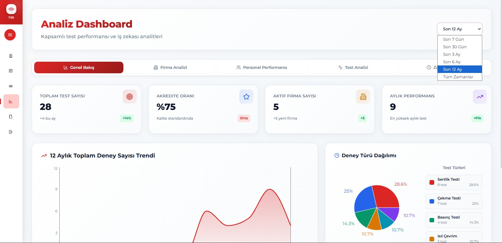
  <br/>
  <em>Yönetici Analiz Paneli (Dashboard) Genel Görünüm</em>
</p>
<p align="center">
  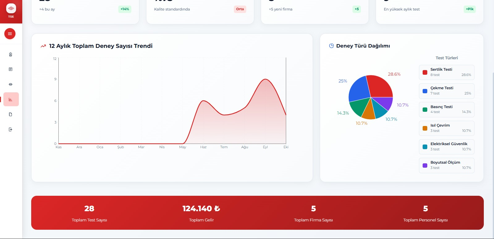
  
  
  <br/>
  <em>Zaman Bazlı Trendler, Firma Dağılımı ve Personel Performans Grafikleri</em>
</p>

---

### 3. Deney Yönetimi Modülü

#### A. Yeni Deney Kaydı (`src/pages/DeneyEkle`)
Laboratuvara gelen numunelerin sisteme ilk girişinin yapıldığı sayfadır.
- **Dinamik Form Yapısı:**
  - **Firma Seçimi:** Veritabanındaki kayıtlı firmalar dropdown (açılır liste) olarak gelir.
  - **Deney Türü:** Seçilen deney türüne göre (örn: TS EN ISO 6892-1) ilgili standartlar otomatik yüklenir.
  - **Fiyat Hesaplama:** Deney türü seçildiğinde, sistemde tanımlı birim fiyat otomatik olarak forma yansır.
  - **Personel Atama:** Deneyi yapacak personel listeden seçilir.

<p align="center">
  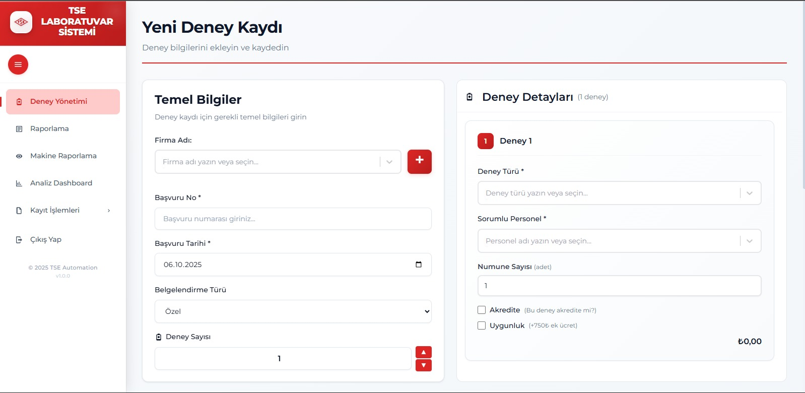
  <br/>
  <em>Yeni Deney Başvuru Formu</em>
</p>

#### B. Raporlama ve Arşiv (`src/pages/Raporla`)
Geçmiş ve güncel tüm deneylerin listelendiği veri merkezidir.
- **Gelişmiş Tablo:** Deney tarihi, firma, test türü, personel ve durum bilgilerini içeren detaylı liste.
- **Filtreleme:**
  - Tarih aralığına göre (Başlangıç - Bitiş).
  - Firma adına göre arama.
  - Deney durumuna göre (Tamamlandı/Bekliyor).
- **Excel Export:** `ExcelJS` entegrasyonu sayesinde, filtrelenmiş veriler tek tuşla formatlı bir Excel raporu olarak indirilebilir.

<p align="center">
  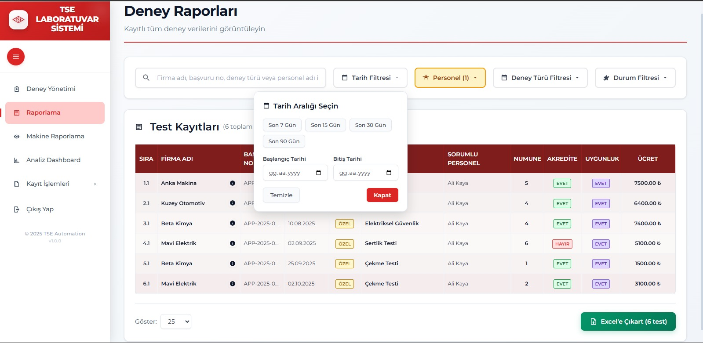
  
  <br/>
  <em>Deney Raporlama Ekranı ve Otomatik Oluşturulan Excel Çıktısı</em>
</p>

---

### 4. Makine Yönetimi ve Bakım Takibi

#### A. Makine Listesi ve Durum (`src/pages/MakineRaporla`)
Laboratuvar envanterinin canlı takibini sağlar.
- **Akıllı Renk Kodları:**
  - 🔴 **Kırmızı:** Kalibrasyon veya bakım tarihi geçmiş cihazlar.
  - 🟡 **Sarı:** Kalibrasyonuna 30 günden az kalmış cihazlar (Uyarı).
  - ⚪ **Beyaz:** Durumu normal cihazlar.
- **Hızlı İşlemler:** Her satırda bulunan butonlar ile o makineye ait "Kalibrasyon Geçmişi" veya "Bakım Geçmişi" görüntülenebilir.
- **Modal Entegrasyonu:** Liste üzerinden direkt olarak yeni bakım veya kalibrasyon kaydı girilebilir (`KalibrasyonModal`, `BakimModal`).

<p align="center">
  
  <br/>
  <em>Makine Envanter Listesi ve Durum Renk Kodları</em>
</p>
<p align="center">
  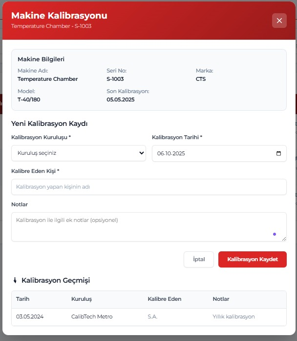
  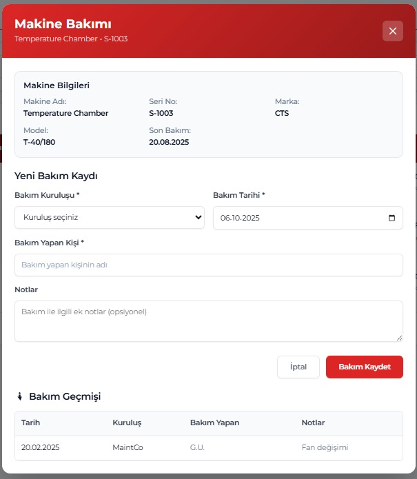
  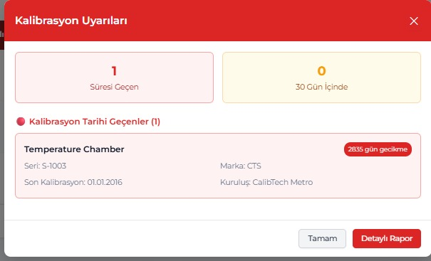
  <br/>
  <em>Kalibrasyon/Bakım Ekleme Modalları ve Uyarı Sistemi</em>
</p>

#### B. Yeni Makine Kaydı (`src/pages/MakineEkle`)
Envantere yeni bir cihaz eklemek için kullanılır.
- **Veri Alanları:** Marka, Model, Seri No, Üretim Yılı, Demirbaş No.
- **Periyot Ayarları:** Cihazın kalibrasyon periyodu (örn: 1 yıl) ve bakım periyodu (örn: 6 ay) burada tanımlanır. Sistem sonraki tarihleri buna göre hesaplar.

---

### 5. Sistem Tanımlamaları (Admin Paneli)
Sistemin dinamik yapısını besleyen veri giriş ekranlarıdır. Bu sayfalar genellikle sadece Admin yetkisine sahip kullanıcılar tarafından görüntülenir.

- **Personel Yönetimi (`src/pages/PersonelEkle`):**
  - Yeni laboratuvar personeli ekleme, unvan ve iletişim bilgilerini girme.
- **Firma Yönetimi (`src/pages/KullaniciEkle`):**
  - Hizmet verilen müşteri firmaların vergi no, adres ve yetkili kişi bilgileriyle kaydı.
- **Deney Türü Tanımlama (`src/pages/DeneyTuruEkle`):**
  - Laboratuvarda yapılan testlerin standart kodları (ISO, EN, TS), süreleri ve güncel birim fiyatları buradan yönetilir.
- **Dış Kaynak Yönetimi:**
  - **Kalibrasyon Kuruluşları (`src/pages/KalibrasyonKurulusEkle`):** Cihazların kalibrasyonunu yapan akredite kuruluşların kaydı.
  - **Bakım Kuruluşları (`src/pages/BakimKurulusEkle`):** Cihazların bakımını yapan yetkili servislerin kaydı.

<p align="center">
  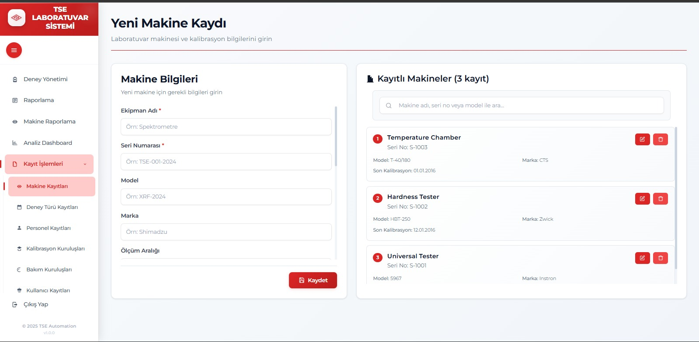
  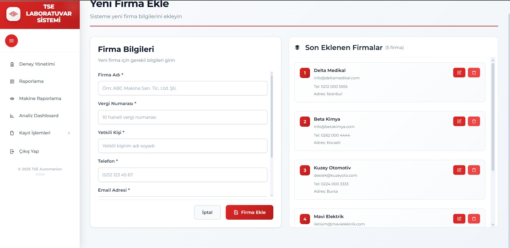
  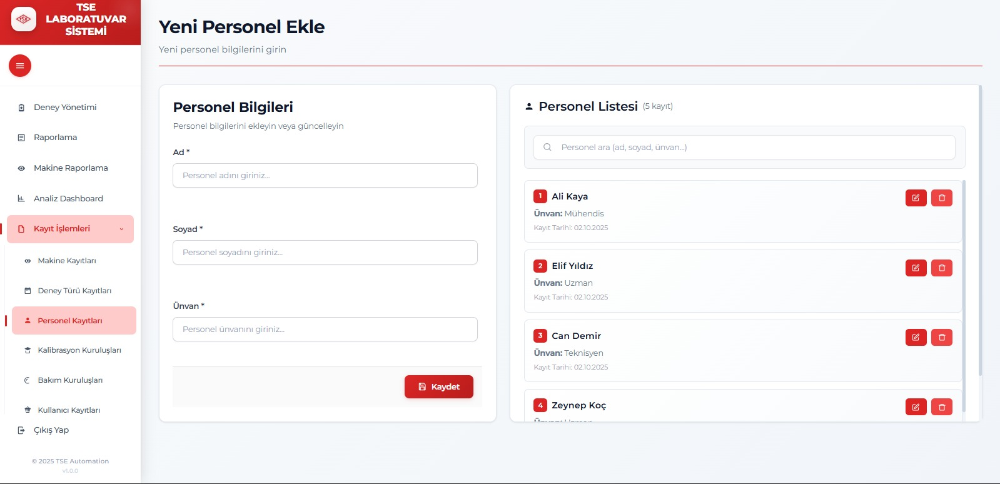
  <br/>
  <em>Temel Varlık Tanımlama Ekranları (Makine, Firma, Personel)</em>
</p>
<p align="center">
  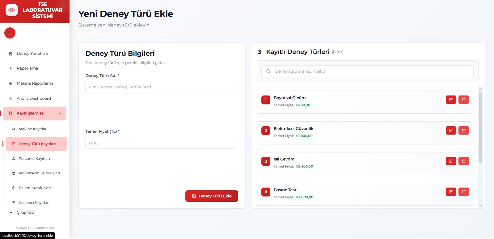
  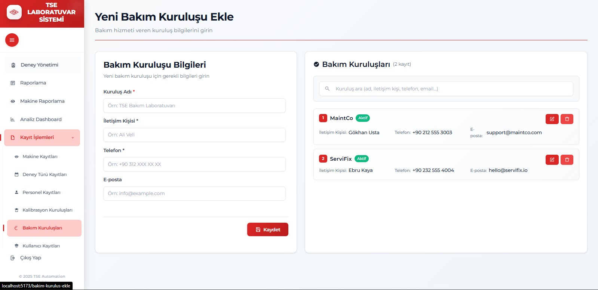
  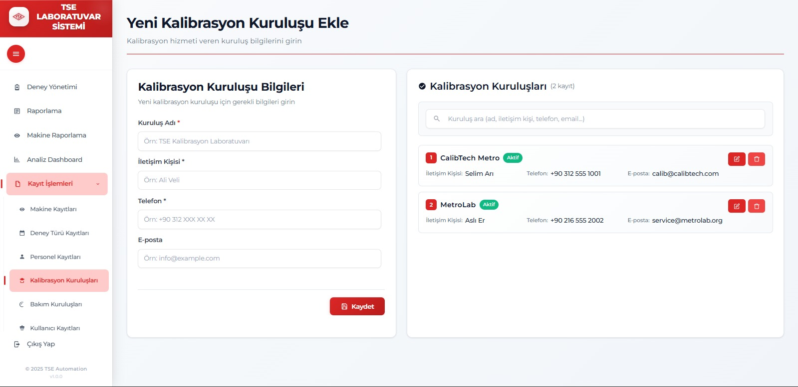
  <br/>
  <em>Sistem Parametreleri ve Dış Kaynak Yönetimi</em>
</p>

---

### 6. Otomasyon Servisi (Automated Reports)
Kullanıcı müdahalesi gerektirmeyen, arka planda çalışan akıllı raporlama sistemidir.

- **Teknoloji:** `node-cron` kütüphanesi ile zamanlanmış görevler (Cron Jobs) oluşturulur.
- **Çalışma Mantığı:**
  1.  Her Pazartesi saat 09:00'da tetiklenir.
  2.  Veritabanına bağlanarak "Son 7 gün içinde tamamlanan" deneyleri sorgular.
  3.  Bu verileri işleyerek okunabilir bir Excel dosyası oluşturur.
  4.  `Nodemailer` servisi üzerinden, sistemde tanımlı yönetici e-posta adreslerine bu Excel dosyasını ek olarak gönderir.
- **Avantajı:** Yöneticilerin sisteme girmesine gerek kalmadan haftalık performansı e-posta kutularında görmelerini sağlar.

<p align="center">
  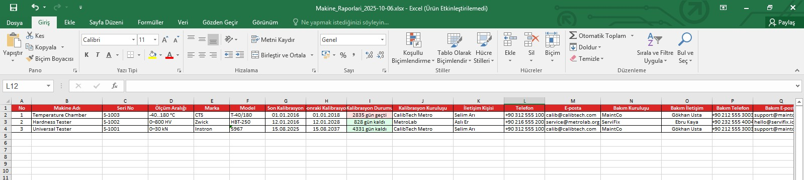
  <br/>
  <em>Otomatik Gönderilen Haftalık Bilgilendirme E-postası</em>
</p>

---

## 🛠️ Kullanılan Teknolojiler

### Frontend

| Teknoloji | Açıklama |
|-----------|----------|
| **React 19** | Modern ve reaktif kullanıcı arayüzü |
| **TypeScript** | Tip güvenli kod yapısı |
| **Vite** | Hızlı geliştirme ve derleme aracı |
| **Recharts** | Veri görselleştirme ve grafik kütüphanesi |
| **ExcelJS** | Excel raporlama işlemleri |
| **React Router** | Sayfa yönlendirme yönetimi |

### Backend & Veritabanı

| Teknoloji | Açıklama |
|-----------|----------|
| **Node.js & Express** | RESTful API sunucusu |
| **PostgreSQL** | Prodüksiyon ortamı için ilişkisel veritabanı |
| **SQLite** | Geliştirme ortamı için hafif veritabanı |
| **Better-SQLite3** | Yüksek performanslı SQLite sürücüsü |
| **JWT & BCrypt** | Güvenli kimlik doğrulama ve şifreleme |

### DevOps & Araçlar

| Araç | Kullanım |
|------|---------|
| **Docker** | Konteynerizasyon ve servis yönetimi |
| **Nodemailer** | E-posta gönderim servisi |
| **Node-Cron** | Zamanlanmış görevler (Cron jobs) |
| **ESLint** | Kod kalitesi ve standartlaştırma |

---

## 🚀 Kurulum ve Çalıştırma Rehberi

### Gereksinimler
- **Node.js** (v18 veya üzeri)
- **Docker & Docker Compose** (PostgreSQL veritabanı için önerilir)
- **Git**

### 1. Projeyi İndirme
```bash
git clone https://github.com/LabXpert/TSE_Automation_WEB.git
cd TSE_Automation_WEB
```

### 2. Çevre Değişkenleri (.env)
Projenin çalışması için gerekli konfigürasyonları yapın.

**Kök Dizin (`.env`):**
```bash
POSTGRES_USER=admin
POSTGRES_PASSWORD=secret
POSTGRES_DB=tse_db
VITE_API_BASE_URL=http://localhost:5000
```

**Server Dizini (`server/.env`):**
```bash
# Geliştirme için SQLite, Prodüksiyon için postgres
DB_DRIVER=sqlite 
SQLITE_PATH=./data/tse.db
JWT_SECRET=cokgizlisifre
```

### 3. Uygulamayı Başlatma

**Seçenek A: Geliştirme Modu (Hızlı Başlangıç)**
Bu modda veritabanı olarak yerel SQLite dosyası kullanılır, Docker gerektirmez.

```bash
# Terminal 1: Backend'i başlat
cd server
npm install
npm run dev

# Terminal 2: Frontend'i başlat
cd ..
npm install
npm run dev
```

**Seçenek B: Prodüksiyon Modu (Docker)**
Tüm sistemi (Frontend, Backend, PostgreSQL, PGAdmin) konteynerler içinde ayağa kaldırır.

```bash
docker-compose up -d --build
```
- **Frontend:** http://localhost:5173
- **Backend API:** http://localhost:5000
- **PGAdmin:** http://localhost:5050

---


